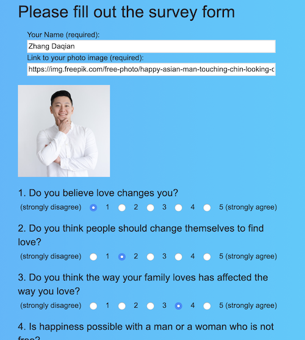

# FriendFinder

## Please try this program on _**Heroku Server**_
### [https://warm-hollows-94004.herokuapp.com](https://warm-hollows-94004.herokuapp.com)

---

This is a prototype of a Dating App, which uses NODE.js and express on the server-side, and jquery and ajax on the client. A user can take a simple survey by answering 10 questions about life and love and the program will find the the bast matched friend for the user. There is no actural "database" to store the candidates information. We provide a few sample data in external file _(data/friends.js)_ as seeds for the early users to start. After a user find a matched friend, his/her data would be kept in the server, but wouldn't be stored in any file or database. (_i.e._  After the server restarts, these data would be lost. It's temperal.) If one needs to change his or her photo or retake the survey, he/she can redo the surver by using the same name. 

This program wouldn't be able to be used as an actual dating app, but it is a good social app for a gathering event, where people get together temporally. They can take an easy survey to find a matched friend during the event time. From the home page, one can click **"View All"** button to see a list of all potential candidates. 

---

---

In order to have the program to find a matched firend, you need to click **"Survey"** button to fill out a survey. 

---

---

In order to reduce the work load on the server and keep the cleanness of the data, the program will ensure all data are entered and show the preview of user's picture before the survey form is submitted. The matching algorithm is built on the server side to be more efficient and safe to handle the data of all candidates.

The algorithm to calculate the compatibility is as follows:


Sum<sub>i=1-10</sub>| X<sub>ij</sub> - X<sub>i0</sub>| 

where X<sub> ij</sub> is the ith score of the jth candidate and X<sub> i0</sub> is the ith score of the current user.

When we take the absolute value of each score between one of the people X<sub>j</sub>  and the current user X<sub>0</sub> and then add up these 10  scores, the 10 scores array would be reduces to one compatibility number. This is the campatibility number for the current user against the jth candidate. This equation can be achieved in JavaScript as follows:

````   X.map((e,i)=>{return Math.abs((e - Y[i]))}).reduce((x,y)=>x+y, 0)   ````

where _**X**_ is the 10 scores array of one of the candidate and _**Y**_ is the current user's 10 scores array.

After calculating the compatibility of all candidates against the current user, the program will send back the most compatible people (who has the lowest compatibility number) to the web in JSON format and the local ajax program will publish the as follows:


---

This program is hosted on the [_**Heroku server**_](https://warm-hollows-94004.herokuapp.com)


